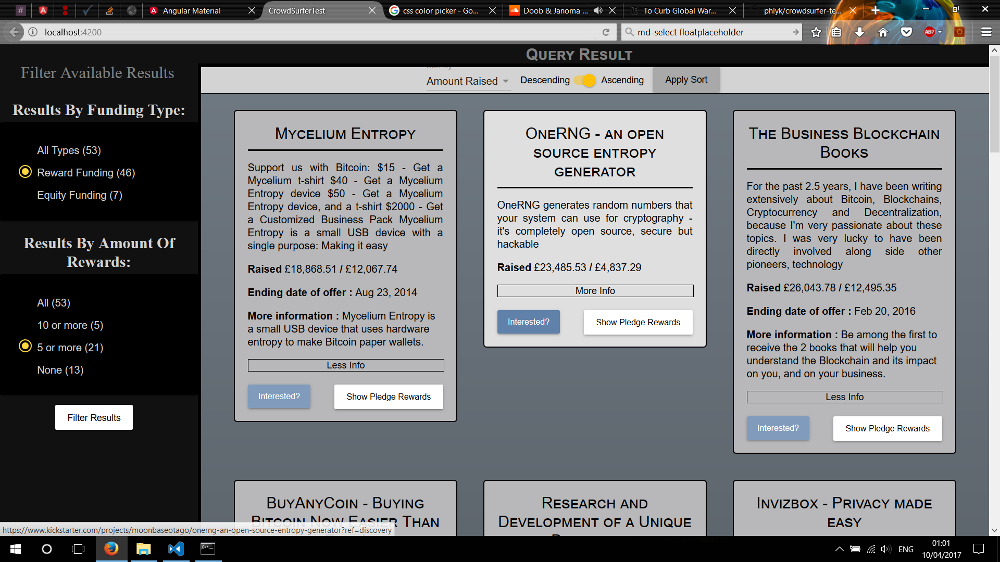

# CrowdSurferTest

Finished result of the task I was instructed to do by CrowdSurfer, a single page results viewer of JSON data.
When I say finished I mean as far as I could get with as much time as I had, coding is a beautiful thing because you can always improve, always develop and always try new things.
I believe I completed what was asked of me to a good standard, I have worked very hard on the project and have been as thorough as I could have been.

Here is a screenshot of how the website appears (minus a few minor css changes):



(**NOTE**): Due to issues with package imports and the Material2 styling all material components have reverted back to their original styling which is a slight pink. This was not the intended colour. 

Let me tell you more about how I came to this result.


## The Task && Structure

As soon as I received the task I thought of a single page layout that could be attractive to a user. I spent a little time designing the UI on paper before proceeding to the implementation phase.
Originally having received the task as an AngularJS (1 not 2) project I spent over 3.5 hours trying to get AngularJS installed, compiling and working using the packages required. This was a painstakingly slow and tedious process that wouldn't work no matter what I tried. Soon after however, I received the soul alieving news that I could work in Angular2. 5 minutes after I was coding. "Let the games begin" I thought.

I approached the task as you can see above with Result 'cards' which would represent and display as much readable, useful data that could appeal to a user. I wanted to have a thin but visible sort bar at the top of the page and a component to filter the results on the left of the page. These eventually became fixed to give a sense of flow and usability as the user scrolled through the page.

The hierarchy of the project (excluding shared files) was as follows:

```
      AppComponent
           |
    DisplayComponent
      /    |     \
  Sort   Result  Filter
   /       |
SortPipe Modal
           |
         Reward
```

My first and logical task was to create a service which would fetch data from the URL given [here](https://s3-eu-west-1.amazonaws.com/crowdsurfer-json-dumps/blockchain-projects.json) which was in JSON format. With the last web development task I did created services for the app on which I was working this was not an issue, in fact I create two ways of going about the data fetch (later refined to one). Once I had the service I parsed the data and displayed them as Results showing some of their key features, this was in pure HTML and looked very messy.

The next step was to transform them into individual cards and getting them to have a fixed size and most importantly display on the same line. Many hours were lost on this due to the way I had structured my SCSS and HTML files, silly me... But one lives and learns and I now know much more about positioning elements using CSS then I did before!

Once the cards were visible I needed a filter component which is just a `<div>` fixed to the left containing a component. Initially I had the one filter type which was instructed of me but my filter component was lonely so I gave it another likely filter the user would want. Getting the two to filter at the same time was a little tricky at first but came to me soon after.

The sort functionality was next and I wanted to make a section out of it rather than just a small drop down menu, so I added the ability to sort ascending or descending with a funky slideToggle from [Angular Material 2](https://material.angular.io/) (more on that shortly). I used a pipe to sort the data based on what the user had selected. 

The last thing I implemented was to display the list of possible rewards an offer could have. For this I used a modal which was opened with a button, this modal was a MdDialog modal provided by the Material2 framework. Inside each modal is a short description of all the rewards.

Note: I have used a few select Material2 components in this app. The material 2 framework, while providing sleek, quality components, proved to be more of a pain than an asset. Having used PrimeNG I found the way of integrating these tools slightly awkward and the documentation was not very well written, that and the difficulty with override certain preexisting CSS features. 

## Special Features

- double filter
- filter numbers displayed
- sort ascending/ descending array pipe
- potential rewards in modal view
- ability to extend each result
- regex to remove `html` tags
- no empty values/descriptions

## Known Issues

Sadly, there were somethings I was not able to solve. Most of these 'bugs' are fairly trivial but required much time which I prioritsed elsewhere. They include:
1. Filter options numbers not always being retrieved
2. Filter options numbers not accurate when filtering on two variables
3. MdSelect placeholder not within SortComponent view, shows as partial text
4. MdDialog (modals) have an unnecessary scroll bar on longer rewards
5. colour scheme isn't fantastic, sorry about that, my design is unpracticed
6. My test doesn't pass

## Improvements && Reflections

I loved this task.
I wanted to add multiple views, routing, forms, selection but time got the better of me.
Ideally I'd have Working tests and better error handling.
Find a way of improving the filter number issue so that it doesn't query the server for each option.

